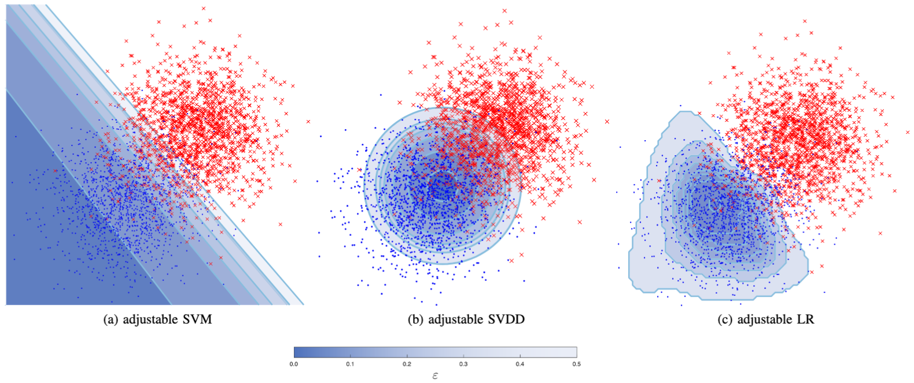

# Misclassification Error Control in Binary Classification through Probabilistic Scaling

Supervised classification recognizes patterns in the
data to separate classes of behaviors. Canonical solutions
contain misclassification errors that are intrinsic to the numerical approximating nature of
machine learning. The data analyst may minimize the classification error on a class at the expense of increasing the
error of the other classes. The error control of such a design phase is
often done in a heuristic manner. 
Thus, this we define the concept of ``probabilistic safety region`` to describe a subset of the input space in which the number of misclassified instances is probabilistically controlled. To achieve this goal, we introduce a new class of classifiers, namely ``adjustable classifiers`` that make the classical classifiers "more elastic", allowing to control the classification boundary.

The model works defining an _adjustable classifier_ as a classic classifier where an scalar  parameter $\rho$ is added to the classifier predictor function

    

Then, exploiting _probabilistic_scaling_ technique (borrowed from [order statistics](https://en.wikipedia.org/wiki/Order_statistic)) it is possible to define with probability no smaller than $1-\delta$ a special region $\mathcal{S}_\varepsilon$ such that

    

This means that the new classifier, $\mathcal{S}_\varepsilon$, is able to maintain the false positive rate (FPR) bounded by $\varepsilon$.

## Content of the Repository

This repository contains the code for the experiments to build probabilistic safety regions using adjustable classifiers.

The following matlab scripts are available:

- ``Adjustable SVDD``: it contains the code for the implementation of adjustable SVDD $f_{\boldsymbol{\theta}}(\boldsymbol{x},\rho) = ||\varphi(\boldsymbol{x})-\boldsymbol{w}||^2 - (R^2 - \rho)$. 
- ``Adjustable SVM``: it contains the code for the implementation of adjustable SVM $f_{\boldsymbol{\theta}}(\boldsymbol{x},\rho) = \boldsymbol{w}^\top\varphi(\boldsymbol{x}) - b + \rho$.
-  ``Adjustable LR``: it contains the code for the implementation of adjustable Logistic Regression $f_{\boldsymbol{\theta}}(\boldsymbol{x},\rho) = \frac{1}{2}-\frac{1}{1+e^{\boldsymbol{w}^\top\varphi(\boldsymbol{x})-b + \rho }}$

Moreover in the folder ``Experiments`` examples on synthetic dataset and a real-world application (Vehicl Platooning dataset) are reported.

## Link with Deep Probabilistic Scaling

Link to a Github Repo where _adjustable neural network_ model is implemented: <https://github.com/AlbiCarle/Deep-Probabilistic-Scaling>.

## Link with Deep Probabilistic Scaling

Concept paper 

Carlevaro, Alberto, et al. "Probabilistic Safety Regions Via Finite Families of Scalable Classifiers." arXiv preprint arXiv:2309.04627 (2023)

and under submission for IEEE Transactions on Neural Networks and Learning Systems.

